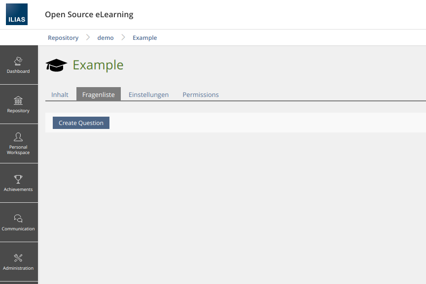
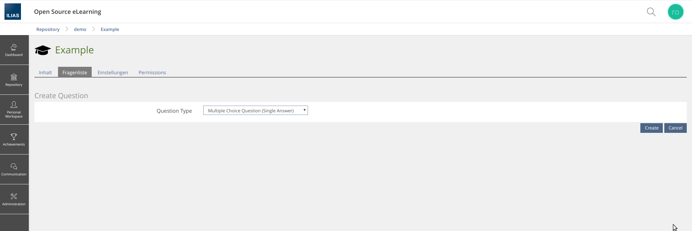
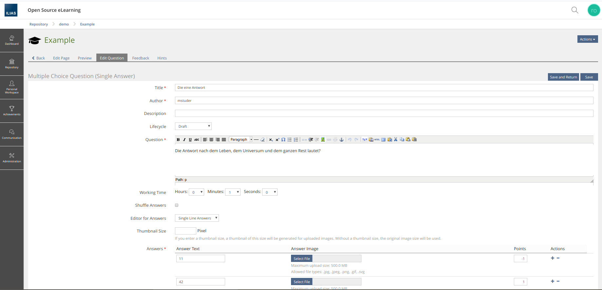

# Create questions

There are two ways to create questions:
1.  Recommended: Get the _Question Creation Link_ and delegate the creation to the authoring environment of ASQ.
2. Usually not recommended: Create the Question without using the authoring environment.

<br>
<br>


## Table of contents
- [Get the Question Creation Link](#get-the-quesetion-creation-link)
- [Create the Question without using the authoring environment](#create-the-question-without-using-the-authoring-environment)  
    
<br>
<br>


## Get the question creation link

### Note


If you use this option for creating a question all requests to the authoring environment are routed through your application. Therefore you must guarantee the ILIAS Ctrl-Flow. Please note that you are responsible for checking the permissions for every authoring action!

### Usage

- [ ] **1. Add the ilCtrl Call _AsqQuestionAuthoringGUI_ to your GUI Class**

```php
<?php

use srag\asq\AsqGateway;

/**
 * Class AsqDemoGUI
 *
 * @ilCtrl_Calls AsqDemoGUI: AsqQuestionAuthoringGUI
 */
class AsqDemoGUI {
[...]
```
>Please reload the control structure - for plugins increase the version of the plugin and update it using the _ILIAS Administration_.

- [ ] **2. Add the _Creation Link_**

E.g add the link as a toolbar button.
```php
public function renderToolbar()
{
        global $DIC;

        $link = AsqGateway::get()->link()->getCreationLink();
        $button = ilLinkButton::getInstance();
        $button->setUrl($link->getAction());
        $button->setCaption($link->getLabel(), false);
        $DIC->toolbar()->addButtonInstance($button);
}
```

- [ ] **3. Catch any redirects to the `ilAsqQuestionAuthoringGUI` class**

Catch any redirects to the `ilAsqQuestionAuthoringGUI` class within the `executeCommand()` method and forward to ilAsqQuestionAuthoringGUI.

The _ilAsqQuestionAuthoringGUI_ constructor requires an _AuthoringContextContainer_ object to hold the metadata of your application. 

An implementation of the redirect may look like this:


```php
[...]
class AsqDemoGUI
{
[...]


/**
 * @return void
 */
public function executeCommand()
{
    global $DIC;

    $next_class = $DIC->ctrl()->getNextClass($this);

    switch (strtolower($next_class)) {
        case strtolower(AsqQuestionAuthoringGUI::class):
            if($DIC->access()->checkAccess('write', '', $this->object->getRefId())) {
                $this->forwardCommandToAuthoringGui();
            }
            // Handle permission mismatch;
            [...]
            break;

[...]

private function forwardCommandToAuthoringGui()
{
        global $DIC;

        $backLink = $DIC->ui()->factory()->link()->standard(
            $DIC->language()->txt('back'),
            $DIC->ctrl()->getLinkTarget($this, self::CMD_EDIT_QUESTIONS));

        $authoring_context_container = new AuthoringContextContainer(
            $backLink,
            $this->object->getRefId(),
            $this->object->getId(),
            $this->object->getType(),
            $DIC->user()->getId()
        );

        $asq = new AsqQuestionAuthoringGUI($authoring_context_container);

        $DIC->ctrl()->forwardCommand($asq);
}
```

### Example

**Button: Create Question**



**Authoring environment: Choose Question Type**



**Authoring environment - Edit Question**



<br>
<br>


## Create the question without using the authoring environment

### Note

An alternative way is to directly create questions without using the authoring environment. This method should only be used if necessary.

> This API Call will changed in the future. The Question Type Parameter will be a _Fqdn class name_

### Usage

```php
AsqGateway::get()->question()->createQuestion(int $type, int $container_id, string $content_editing_mode = ContentEditingMode::RTE_TEXTAREA)
```