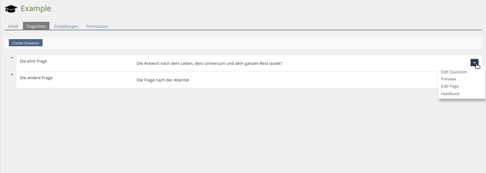
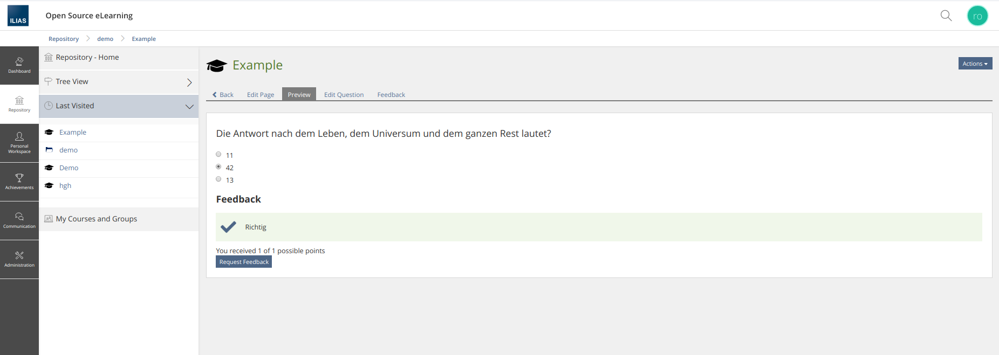

# Edit Questions

ASQ provides the following links to the authoring environment:
* Edit Question
* Preview Question
* Edit Page
* Edit Feedback

Additionally, it's possible to use a single independent edit form.
<br>
<br>


## Table of Contents

- [Usage of the Edit Links](#usage-of-the-edit-links)
- [Get question edit form](#get-question-edit-form)
    
<br>
<br>


## Usage of the Edit Links

### Note

You can get the links by passing the Question UUID:
```php
AsqGateway::get()->link()->getEditLink('7464973d-6cf3-4142-949a-3d7fd4d48169')
```

### Usage
This example shows how to display all questions of your container with an unordered list using an action menu.
```php
private function showQuestions()
    {
        global $DIC;
        $questions = AsqGateway::get()->question()->getQuestionsOfContainer($this->object->getId());

        $items = [];
        foreach ($questions as $question) {
            $items[] = $DIC->ui()->factory()->item()
                ->standard(
                    $question->getData()->getQuestionText()
                )
                ->withLeadText($question->getData()->getTitle())
                ->withActions(
                    $DIC->ui()->factory()->dropdown()->standard(
                        [
                            AsqGateway::get()->link()->getEditLink($question->getId()),
                            AsqGateway::get()->link()->getPreviewLink($question->getId()),
                            AsqGateway::get()->link()->getEditPageLink($question->getId()),
                            AsqGateway::get()->link()->getEditFeedbacksLink($question->getId())
                        ]
                    )
            );
        }
        $item_list = $DIC->ui()->factory()->listing()->unordered($items);

        $DIC->ui()->mainTemplate()->setContent($DIC->ui()->renderer()->render($item_list));
    }
```
### Example
***Question list with an action menu***



***Question preview***


    
<br>
<br>


## Get question edit form

### Note
Returns the form used to edit the question. The form is of the type ilPropertyFormGUI and works like one.
It is easier to use the provided classes listed above.

### Usage
```php
$form = AsqGateway::get()->ui()->getQuestionEditForm($question_dto);
$form->setFormAction($DIC->ctrl()->getFormAction($this, self::CMD_SHOW_FORM));
$form->addCommandButton(self::CMD_SAVE_FORM, $DIC->language()->txt('save'));
$DIC->ui()->mainTemplate()->setContent($form->getHTML());
```

To save:

```php
$question = $form->getQuestion();
AsqGateway::get()->question()->saveQuestion($question);
```